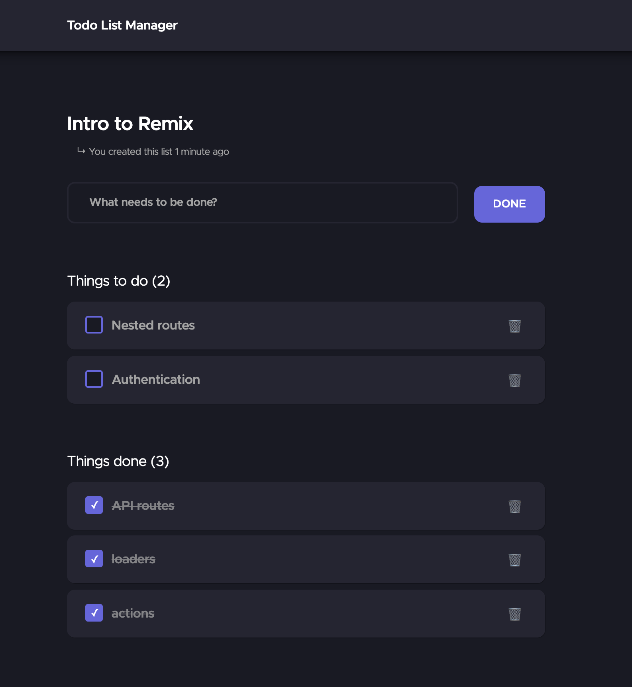

# Todo List Manager

> This project showcases an hexagonal architecture approach for front-end projects.



This is a Remix application, you may want to check out the [Remix documentation](https://remix.run/docs).

## Context

Modern tooling blurs the front-end line. _Front-end_ does not mean _Client-side_ anymore. Frameworks like 
**Next.js** or **Remix.run** enable libraries like **React** to run in a browser-less environment
at request-time (and at build-time if you're using **Next.js**'s `getStaticProps`).

This enables new architectural patterns for front-end developers, which can now move some logic to 
the server. This can improve security and make some things easier, for instance :

- authentication using cookies ;
- secrets can be safely stored and used on the server ;
- data fetching can be made directly from the database (the API layer is often abstracted. 
    See [Next.js](https://nextjs.org/docs/basic-features/data-fetching#getserversideprops-server-side-rendering), 
    [Remix.run](https://remix.run/docs/en/v1/guides/api-routes#routes-are-their-own-api)) ;

Seeing the blurred line between client-side and server-side, there is now an
opportunity to use an "unified [hexagon](https://alistair.cockburn.us/hexagonal-architecture/)", leaving generic concerns (like data fetching) to your framework of choice.

## Principles

This project is based on the following principles :

- most of the work should **be done on the server** ;
- specifically, any data preparation should happen on the server ; 
- the client responsibility is primarily using traditional Web features like **forms** and **navigation** ;

## Implementation

The project is organized as such :

- `app/application` : where **React** components and **Remix** stuff lives ;
- `app/domain` : where **domain modeling** happens for writing operations (domain interfaces, behaviors and ports) ;
- `app/query` : where **queries** are modeled for reading operation (preparing data for our pages) ;
- `app/infrastructure` : where the ports / queries implementation live (repositories / database queries) ;

## Limitations

The following limitations have been identified :

- Since the data structure are sent over the network (client <> server communications), they must be simple
  objects used as JSON. For instance, complex objects like `Date` cannot be used as a
  response for reads or writes.

## Useful scripts

### Development

From your terminal:

```sh
yarn dev
```

This starts your app in development mode, rebuilding assets on file changes.

To log in, use the following credentials:

- Login: `chan`
- Password: `azerty`

### Tests

From your terminal:

```sh
yarn test
```

This runs the automated tests against the source code.

#### E2E tests

The project uses [Cypress](https://www.cypress.io/) to automatically interact with the app, like a user would do.

From your terminal:

```sh
yarn e2e:run
```

This runs the E2E tests in your terminal. If you want to "see" the tests running in the browser, use:

```sh
yarn e2e:dev
```

### Deployment

First, build your app for production:

```sh
yarn build
```

Then run the app in production mode:

```sh
yarn start
```

Now you'll need to pick a host to deploy it to.

